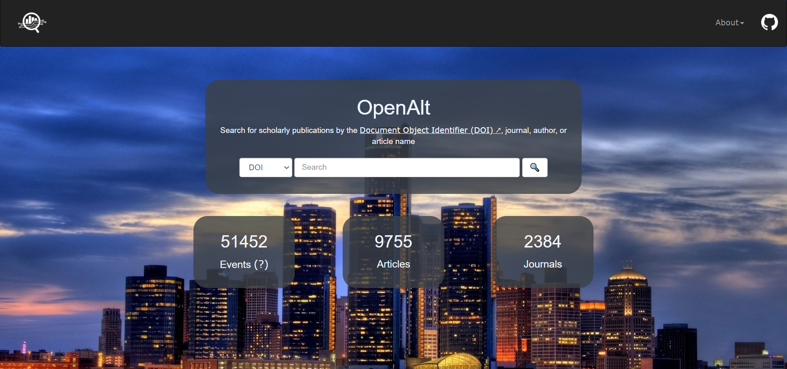
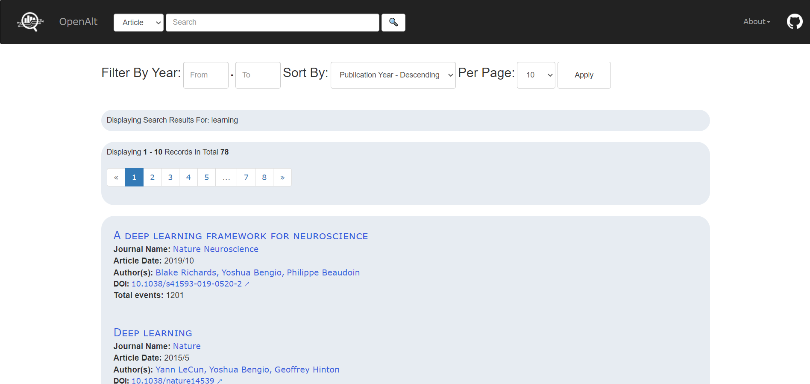
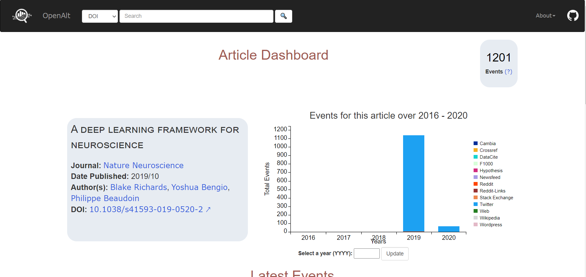
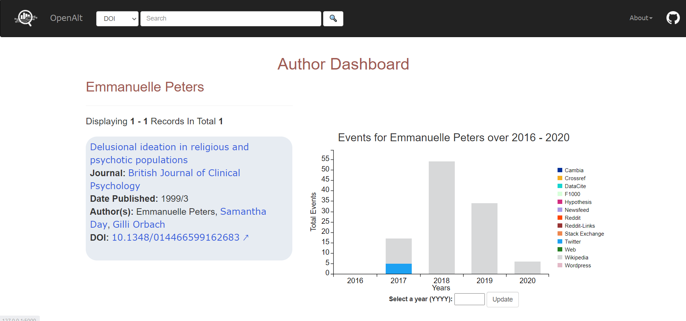
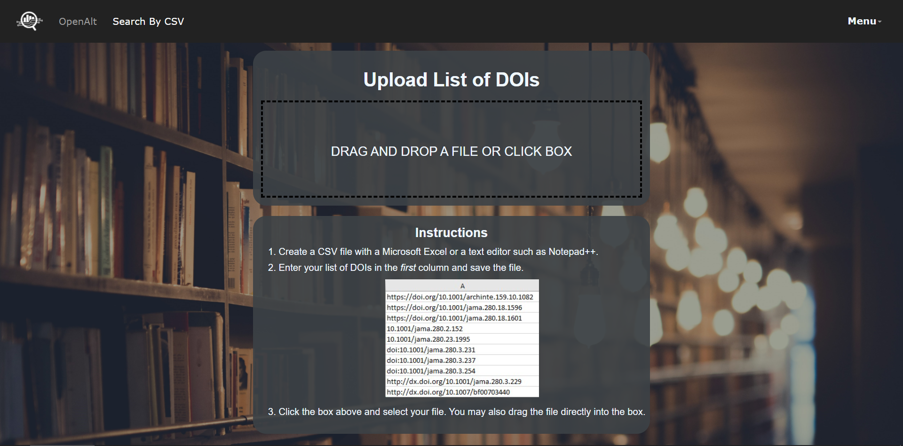
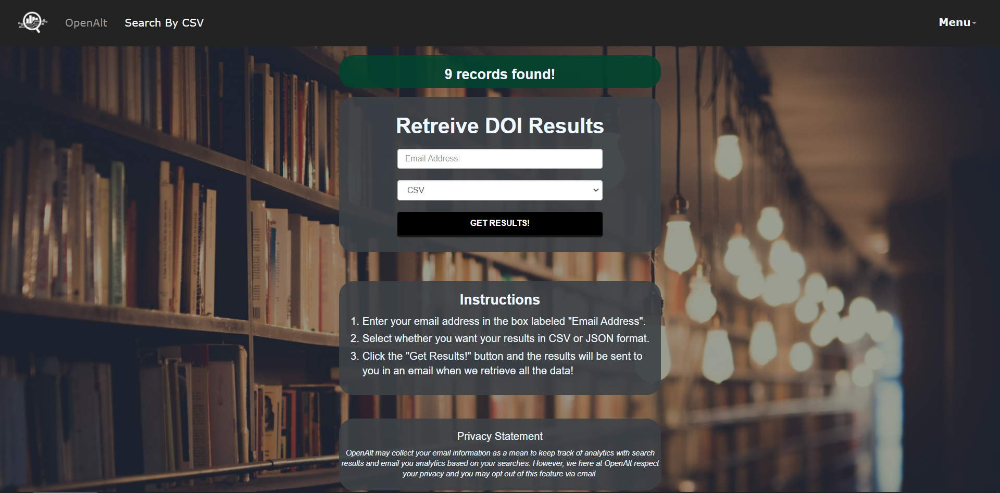

# Building an Interface for Crossref Event Data 
This is only an overview. Check the [manual](./USER_MANUAL.md) for more details. For a PDF version of the manual click [here](./OpenAlt_User_Manual.pdf).

## Overview 
Platforms such as Google Scholar and Web of Science allow users to search for authors, search by paper/article, and see how many citations a given paper has. The goal of this project is to create a dashboard-style interface that displays activity and engagement surrounding scientific publications. Rather than focusing on numbers of citations, we will be displaying the number of interactions. The data describing these interactions is taken from the [Crossref API](https://www.eventdata.crossref.org/guide/service/quickstart/).  

## Where the data comes from 
Crossref is an official agency responsible for assigning DOIs (Document Object Identifier) to published research. They scrape the web across 13 different platforms (Twitter, Reddit, Wikipedia, and others) looking for interactions with scientific papers.
These interactions can be in the form of tweets, reddit posts, or wikipedia references. See the Crossref [documentation](https://www.eventdata.crossref.org/guide/data/about-the-data/) to learn about the platforms. 

OpenCitations is an organization dedicated to publication of citation and bibliographic data. To learn more about OpenCitations data, click [here](https://opencitations.net/about).

We also have been given data from our friends at SciELO to add foreign publications to our records. To learn more about SciELO data, click [here](https://scielo.org/en/about-scielo/scielo-data-en/about-scielo-data/).

## The Website 
We are developing a website which will allow users to search our databases for DOI's, authors, paper titles, or journals. Users will be able to see how many Events, and of which type, a given paper or author has generated. The number of papers published per year for a given journal will also be shown.

## Screenshots
Here are some screenshots taken with a small slice of the total data.

### Landing Page
  

### Search Results Page
  

### Article Dashboard Page
  

### Author Dashboard Page
  

### Bulk Search Pages ###
  
  

## Dependencies and their Licenses 
// One paragraph regarding the way we tested our application. for ex, testted with, ...OS, ....application, for ... many hours.

| Software                        | License                            | Version                         |
|:--------------------------------|:-----------------------------------|:--------------------------------|
| MySQL                           | GPL-2.0 License                    | 8.0.21                          |
| MySQL Python Connector          | GPL-2.0 License                    | 8.0.21                          |
| Python                          | Python Software Foundation License | 3.8.0                           |
| Bootstrap                       | MIT License                        | 3.3.7                           |
| C3                              | MIT License                        | 3.5.1                           |
| D3                              | BSD-3-Clause License               | 5.7.2                           |
| jQuery                          | MIT License                        | 0.7.20                          |

 

| Python Module             | License                    | Version                    |              
|:--------------------------|:---------------------------|:---------------------------|
| schedule                  | MIT License                | 0.6.0                      |
| crossrefapi               | BSD-2-Clause License       | 1.5.0                      |
| mysql-connector-python    | GPL-2.0 License            | 8.0.21                     |
| flask                     | BSD-3-Clause License       | 1.1.2                      |
| flask-mysqldb             | MIT License                | 0.2.0                      |
| virtualenv                | MIT License                | 20.0.35                    |
| python-dateutil           | Apache-2.0 License         | 2.8.1                      |
| flask-paginate            | BSD-3-Clause License       | 0.7.1                      |
| pytz                      | MIT License                | 2020.1                     |
| MongoDB                   | SSPL v1.0 License          | 4.4                        |

 

## Contact Info
| Name                            | LinkedIn                                                              | Email                         |
|:--------------------------------|:-----------------------------------|:-------------------------------- |
| Darpan Shah                     | https://www.linkedin.com/in/darpanshah-/                              | darpanshah7@gmail.com         |
| Rihat Rahman                    | https://www.linkedin.com/in/rihat-rahman/                             | rihat.rafi@gmail.com          |
| Salsabil Bakth                  | https://www.linkedin.com/in/salsabil-bakth/                           | salsabilbakth@gmail.com       |
| Mohammad Tahmid                 | https://www.linkedin.com/in/mtahmid/                                  | mtahmid745@gmail.com          |                               
| Tabish Shaikh                   | https://www.linkedin.com/in/tabish-shaikh-0497011a4/                  | tabishshaikh97@gmail.com      |                               

## 	Acknowledgements 
We would like to thank:  
* Dr. Timothy Bowman for the project idea and guidance! 💡  
* Saeid Mofrad and Minh Nguyen for assisting us with technical questions 💬 
* Seyed Ziae Mousavi Mojab for teaching the class, of which this project was a part 🍎
